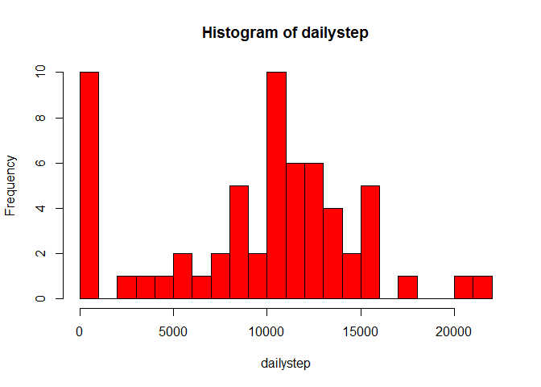
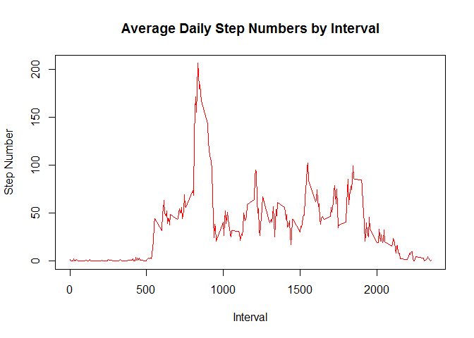
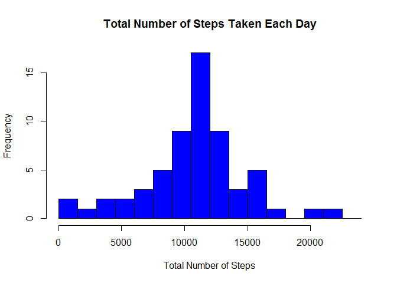
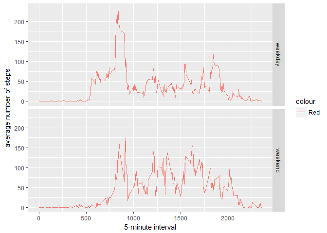

PA1\_template.Rmd
================
Alexander Johnston
June 30, 2017

R Markdown
----------

Loading and preprocessing the data
----------------------------------

``` r
if(!file.exists('activity.csv')){
    unzip('activity.zip')
}
activity<- read.csv('activity.csv')
```

### What is the mean total number of steps taken per day

Made a histogram of the total number of steps taken each day, with the following code:

``` r
dailystep <- tapply(activity$steps, activity$date, FUN = sum, na.rm = TRUE)
hist(dailystep, breaks=20, col="red")
```



Working out the mean and median average:

``` r
stepmean <- mean(dailystep)
stepmedian <- median(dailystep)
```

The `mean` is 9354.2295082 and the `median` is 10395.

### What is the average daily activity pattern?

Made a time series plot of the 5-minute interval (x-axis) and the average number of steps taken, averaged across all days (y-axis)

``` r
stepsbyinterval <- aggregate(steps ~ interval, activity, mean)
plot(stepsbyinterval$interval,stepsbyinterval$steps, type="l", main="Average Daily Step Numbers by Interval", xlab="Interval", ylab="Step Number", col="red")
```



``` r
interval_largest <- stepsbyinterval[which.max(stepsbyinterval$steps),1]
```

The 5-minute interval, on average across all the days in the dataset, which has the maximum number of steps is 835.

### Imputing missing values

Calculated the total number of missing values in the dataset

``` r
MissingValues <- length(which(is.na(activity$steps)))
```

Created a new dataset that is equal to the original dataset but with the missing data filled in.

``` r
library(Hmisc)
```

    ## Loading required package: lattice

    ## Loading required package: survival

    ## Loading required package: Formula

    ## Loading required package: ggplot2

    ## 
    ## Attaching package: 'Hmisc'

    ## The following objects are masked from 'package:base':
    ## 
    ##     format.pval, round.POSIXt, trunc.POSIXt, units

``` r
Imputedactivity <- activity
Imputedactivity$steps <- impute(Imputedactivity$steps, fun=mean)
```

Made a histogram of the total number of steps taken each day and calculate and report the mean and median total number of steps taken per day.

``` r
dailystep2 <- tapply(Imputedactivity$steps, activity$date, sum, na.rm=TRUE)
hist(dailystep2, col= "blue", breaks=seq(from=0, to=25000, by=1500), main="Total Number of Steps Taken Each Day", xlab="Total Number of Steps")
```



Working out the mean and median average:

``` r
stepmean2 <- mean(dailystep2)
stepmedian2 <- median(dailystep2)
```

The `mean` is 1.076618910^{4} and the `median` is 1.076618910^{4}.

Mean and median values are higher after inputing the missing data.

### Are there differences in activity patterns between weekdays and weekends?

Create a new factor variable in the dataset with two levels - "weekday" and "weekend" indicating whether a given date is a weekday or weekend day.

``` r
activity$dateType <-  ifelse(as.POSIXlt(activity$date)$wday %in% c(0,6), 'weekend', 'weekday')
```

Make a panel plot containing a time series plot of the 5-minute interval (x-axis) and the average number of steps taken, averaged across all weekday days or weekend days (y-axis).

``` r
avgactivity <- aggregate(steps ~ interval + dateType, data=activity, mean)
ggplot(avgactivity, aes(interval, steps, color="Red")) + 
    geom_line() + 
    facet_grid(dateType ~ .) +
    xlab("5-minute interval") + 
    ylab("average number of steps")
```


